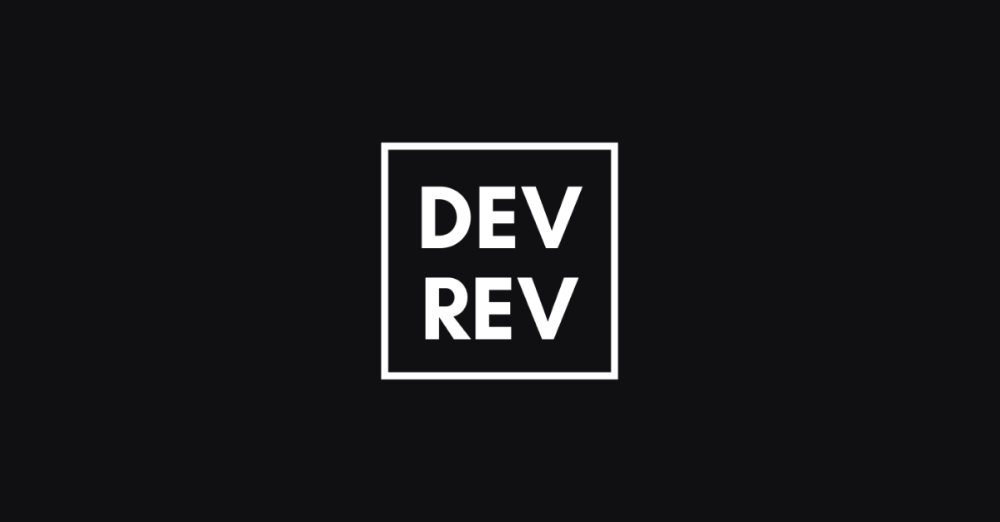

<p align="center"></p>

<h2 align="center">DevRev Morocco</h2>
<h4 align="center">
A weekly live show featuring conversations with great tech minds about software engineering, tech careers, and startups.</h4>

---

Website : https://devrev.ma/

## Contents

- [Details about the project](#Details-about-the-project)
- [Getting Started](#getting-started)

## Details about the project:

- React library.
- Nextjs framework.
- Styled-components.
- PWA using next-offline.
- SEO using next-seo.

## Getting Started

First, install all dependencies for the project:

```bash
yarn install
```

Second, run the development server:

```bash
yarn dev
```

Open [http://localhost:3000](http://localhost:3000) with your browser to see the
result.

## Learn More

To learn more about Next.js, take a look at the following resources:

- [Next.js Documentation](https://nextjs.org/docs) - learn about Next.js
  features and API.
- [Learn Next.js](https://nextjs.org/learn) - an interactive Next.js tutorial.

You can check out
[the Next.js GitHub repository](https://github.com/vercel/next.js/) - your
feedback and contributions are welcome!

This is a [Next.js](https://nextjs.org/) project bootstrapped with
[`create-next-app`](https://github.com/vercel/next.js/tree/canary/packages/create-next-app).
